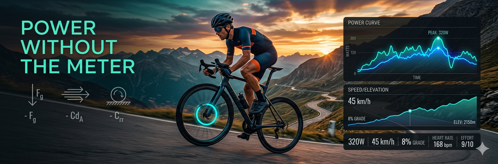

# Cycling ePower

<div align="center">




**Estimate realistic cycling power output from GPS data — no power meter required.**

Physics-based model that combines speed, elevation, air drag, rolling resistance, gravity, and acceleration to deliver accurate wattage estimates from GPX, TCX, or FIT files.

Perfect for cyclists, coaches, data enthusiasts, and anyone who wants power insights from old rides.

</div>

## ✨ Features

- Accurate physics model (gravity, aero, rolling, inertia)
- Supports GPX, TCX, FIT files
- Configurable rider & bike parameters (weight, CdA, Crr, etc.)
- Elevation data handling (SRTM or custom)
- Command-line + Python library usage
- Clean output with power, normalized power, and metrics

## 🚀 Quick Start

```bash
git clone https://github.com/jahmia/cycling_epower.git
cd cycling_epower
pip install -r requirements.txt
```

## ⚙️ Configuration

Copy config.yaml.template to config.yaml and adjust parameters for your setup (rider weight, bike specs, environmental factors, etc.).

## 📋 Project Status & Roadmap
- [x] Mean / normalized power calculation
- [x] Better handling when cadence = 0 (set power to null)
- [x] Ignore duplicated point along time
- [x] Detection and correction of speed/power drift
- [x] Option to bypass cadence sensor
- [x] Cleaner object-oriented API (dot notation)
- [x] Remove duplicate timestamps
- [ ] Analysis : Open point as URL
- [ ] Batch [elevation](https://github.com/jahmia/cycling_epower/blob/master/elevation/mg_elevation.py#L23) processing
- [ ] Support for direct start/end power values

Contributions are very welcome!

## License
GPL-3.0

---
<div align="center">

[](https://www.python.org)
[](LICENSE)
[](https://github.com/jahmia/cycling_epower/commits/main)
[](https://github.com/jahmia/cycling_epower/issues)
[](https://hits.sh/github.com/jahmia/cycling_epower/)

What's your watts ?

**Made with ❤️ for the cycling community**

</div>